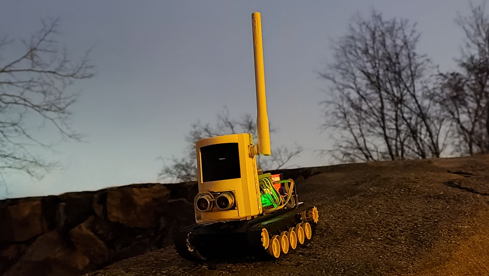
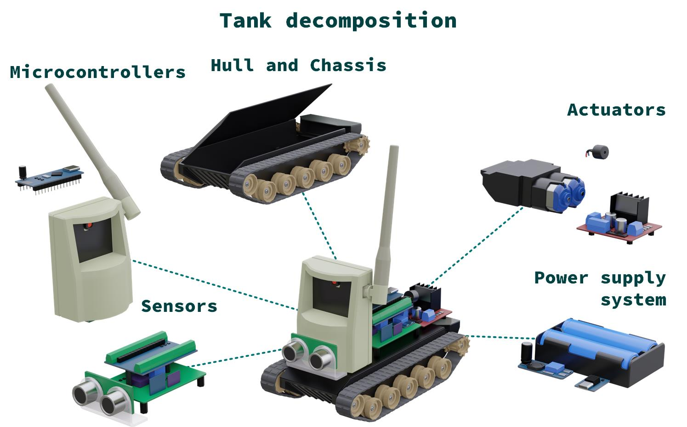
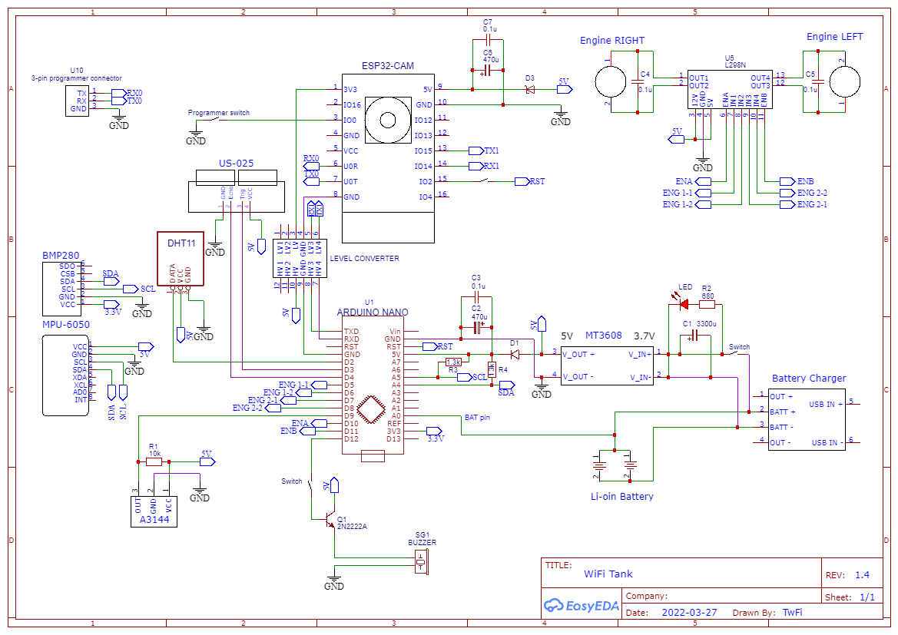

# Wi-Fi-controlled tank project

**What is used for the project:**
 - ESP-32-Cam board for Wi-Fi communication📡  and camera operation 🎥.
 - Arduino Nano for motor control 🕹️ and sensor processing 🌡️.
 - Android device 📱 with control terminal (application on Unity game engine).

## If you want to know😎:

 - How I made this project 🛠️?
 - How to improve range and reliability of Wi-Fi connection on ESP-32 🚀?
 - How to receive MJPEG streams in Unity 📺?
 - Is there a difference between HTTP, WebSocket and SSE protocols for remote control?
 - Increase the FPS on the ESP-32 camera and configure it properly 🚀.
 - How to implement error protection during remote control ❌?
 - Learn about the interesting bugs like: antenna on the ESP-32, I2C arduino and EPS-32 and GPIO0 pin 🐞.
 - How to do remote control with low latency ⏱️.
 - How to achieve power stability for RC vehicles ⚡?
 - See an example of a working tank on these technologies with cool pictures 🖼️.

[Read my article](https://www.hackster.io/twfi/how-to-create-a-wi-fi-tank-with-a-camera-c17e5e). There I wrote all my experiences in building the tank. I really hope it helps and inspires someone to create cool stuff 😉.

**Circuit diagram of the tank**

